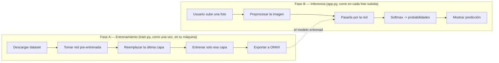

# Cómo funciona este clasificador de residuos

Este documento recorre [`train.py`](../train.py) y [`app.py`](../app.py) paso a
paso, en el orden en que realmente se ejecutan, para que puedas seguirlo mientras
lees el código. No asume conocimiento previo de transfer learning ni de redes
neuronales.

## El panorama general

Entrenar una red neuronal de reconocimiento de imágenes desde cero requiere millones
de fotos etiquetadas y días de cómputo en GPUs — nada de eso es realista para un
proyecto de práctica. **Transfer learning** (aprendizaje por transferencia) resuelve
esto: partimos de una red ya entrenada en un problema gigante y genérico
(clasificar 1000 categorías de objetos comunes, usando 1.2 millones de fotos), y solo
le enseñamos la parte final — la que decide "a qué categoría pertenece esto" — con
nuestras propias categorías (cardboard, glass, metal, paper, plastic, trash) y muchas
menos imágenes.

Igual que con el chatbot RAG, aquí también hay dos fases completamente separadas, y
cada una corre en un entorno distinto:



**Fase A es `train.py`** — corre una sola vez, en tu computador, y necesita PyTorch
(pesado). **Fase B es `app.py`** — corre en el servidor donde despliegas la app, en
cada foto que alguien sube, y solo necesita ONNX Runtime (liviano, sin PyTorch). Esa
separación es deliberada: el modelo ya entrenado (`model/waste_classifier.onnx`) es
el único puente entre ambas fases.

---

## Fase A — Entrenamiento ([`train.py`](../train.py))

### A1. Conseguir un dataset balanceado ([`build_balanced_subset`](../train.py), línea 52)

```python
dataset = load_dataset(DATASET_ID, split="train")
...
for i, label in enumerate(dataset["label"]):
    if counts[label] < IMAGES_PER_CLASS:
        indices.append(i)
        ...
subset = dataset.select(indices)
```

`garythung/trashnet` en Hugging Face tiene 5054 imágenes repartidas de forma
desigual entre las 6 categorías (por ejemplo, "trash" tiene muchas menos que
"paper"). Si entrenáramos con el dataset tal cual, el modelo aprendería a predecir
siempre las clases más comunes porque estadísticamente acierta más así — un problema
clásico llamado **desbalance de clases**. La solución acá es simple: tomar como
máximo `IMAGES_PER_CLASS = 150` imágenes de cada categoría, así el modelo ve la misma
cantidad de ejemplos de cada una.

*(Nota histórica: la primera versión de este script usaba `streaming=True` para
evitar descargar el dataset completo de una vez, pero esa vía se caía con
`MemoryError` al decodificar ciertas imágenes — un bug de la librería con este
dataset en particular. La descarga normal, aunque baja más datos por adelantado, es
la que terminó funcionando de forma confiable.)*

### A2. Tomar la red pre-entrenada y "congelarla" ([`build_model`](../train.py), línea 75)

```python
model = mobilenet_v2(weights=MobileNet_V2_Weights.IMAGENET1K_V1)
for param in model.features.parameters():
    param.requires_grad = False
model.classifier[1] = nn.Linear(model.last_channel, num_classes)
```

MobileNetV2 es una arquitectura de red neuronal convolucional diseñada para ser
pequeña y rápida (pensada originalmente para correr en celulares). `weights=...V1`
descarga sus pesos ya entrenados en ImageNet (1000 categorías genéricas: perros,
autos, tazas, etc.).

Una red así tiene dos partes conceptuales:
- **`model.features`** — muchas capas convolucionales que aprenden a detectar bordes,
  texturas, formas y patrones visuales cada vez más complejos. Este conocimiento es
  genérico y reutilizable para casi cualquier tarea de visión.
- **`model.classifier`** — una o dos capas finales que toman esos patrones
  detectados y deciden "esto es una taza" vs. "esto es un perro". Esta parte es
  específica del problema original (las 1000 clases de ImageNet).

`param.requires_grad = False` "congela" todas las capas de `features`: durante el
entrenamiento, sus pesos no se van a tocar. Solo reemplazamos y entrenamos la última
capa (`model.classifier[1]`), ahora con 6 salidas en vez de 1000. Esto es lo que hace
que el entrenamiento sea rápido (segundos/minutos en CPU, no horas) — la red ya sabe
"ver", solo le enseñamos a re-etiquetar lo que ve con nuestras categorías.

### A3. El bucle de entrenamiento ([`train`](../train.py), línea 83)

```python
for epoch in range(EPOCHS):
    for images, labels in loader:
        outputs = model(images)
        loss = criterion(outputs, labels)
        loss.backward()
        optimizer.step()
```

Una **época** (epoch) es una pasada completa por todas las imágenes de
entrenamiento. En cada una:
1. El modelo predice una categoría para cada imagen del batch (`outputs`).
2. `criterion` (cross-entropy loss) mide qué tan mal predijo comparado con la
   etiqueta real — un número que baja cuando el modelo mejora.
3. `loss.backward()` calcula, matemáticamente, cuánto contribuyó cada peso de
   `classifier[1]` (recuerda: el resto está congelado) a ese error.
4. `optimizer.step()` ajusta esos pesos un poquito en la dirección que reduce el
   error.

Repetir esto `EPOCHS = 5` veces sobre las 900 imágenes fue suficiente para pasar de
~50% de accuracy en la época 1 a ~78% en la época 5 (ver el log de entrenamiento).
`TRAIN_TRANSFORM` (línea 27) también aplica `RandomHorizontalFlip` — voltea algunas
imágenes al azar — para que el modelo no memorice orientaciones específicas y
generalice mejor con pocos datos (una técnica llamada **data augmentation**).

### A4. Exportar a ONNX ([`export_onnx`](../train.py), línea 116)

```python
torch.onnx.export(model, dummy_input, str(onnx_path), ...)
```

ONNX es un formato de archivo estándar para modelos de machine learning, que se
puede ejecutar con **ONNX Runtime** sin necesitar la librería que lo entrenó
(PyTorch, en este caso). Esto es clave para el deploy: el servidor donde corre
`app.py` nunca necesita instalar PyTorch (cientos de MB y mucha RAM) — solo
`onnxruntime`, mucho más liviano. Ya vivimos este problema con el chatbot RAG en
Render (memoria insuficiente con PyTorch); acá lo evitamos desde el diseño.

`labels.json` guarda el orden exacto de las categorías (`["cardboard", "glass",
"metal", "paper", "plastic", "trash"]`) — necesario porque el modelo ONNX solo
devuelve números (probabilidades por posición), no nombres.

---

## Fase B — Inferencia ([`app.py`](../app.py))

Corre en el servidor, una vez por cada foto que un usuario sube.

### B1. Cargar el modelo ([`load_model`](../app.py), línea 16)

```python
session = ort.InferenceSession(str(MODEL_DIR / "waste_classifier.onnx"))
```

Esto pasa una sola vez, cuando arranca el servidor (ver [app.py:50](../app.py)) —
igual que la construcción del vectorstore en el proyecto del chatbot. La `session`
queda en memoria lista para recibir imágenes.

### B2. Preprocesar la imagen ([`preprocess`](../app.py), línea 22)

```python
image = image.convert("RGB").resize((IMAGE_SIZE, IMAGE_SIZE))
array = np.asarray(image, dtype=np.float32) / 255.0
array = (array - MEAN) / STD
array = array.transpose(2, 0, 1)  # HWC -> CHW
```

**Esta es la parte más delicada de todo el proyecto**: el modelo espera los números
de entrada exactamente en el mismo formato que vio durante el entrenamiento. Si algo
no calza, el modelo no falla con un error — simplemente predice mal, en silencio.
Cuatro cosas tienen que coincidir con `TRAIN_TRANSFORM` en `train.py`:

1. **Tamaño**: redimensionar a 160×160 píxeles (`IMAGE_SIZE`, línea 21) — el mismo
   tamaño usado en el entrenamiento.
2. **Rango de valores**: los píxeles de una imagen van de 0 a 255; se dividen por
   255 para llevarlos a 0–1, igual que `transforms.ToTensor()` hace en el
   entrenamiento.
3. **Normalización**: restar `MEAN` y dividir por `STD` — estos números específicos
   son los promedios y desviaciones estándar de ImageNet, una convención que viene
   con los pesos pre-entrenados de MobileNetV2.
4. **Orden de los canales**: PyTorch espera `(canales, alto, ancho)` — "CHW" — pero
   una imagen normal en NumPy/PIL viene como `(alto, ancho, canales)` — "HWC". El
   `.transpose(2, 0, 1)` reordena los ejes para que calcen.

### B3. Ejecutar el modelo y aplicar softmax (líneas 42–43)

```python
(logits,) = session.run(None, {input_name: inputs})
probs = softmax(logits[0])
```

La red devuelve 6 números crudos (**logits**) — uno por categoría — que pueden ser
positivos, negativos, o cualquier magnitud; no son probabilidades todavía, solo
indican qué tan "a favor" está el modelo de cada opción relativa a las demás.

**Softmax** ([app.py:30](../app.py)) convierte esos 6 números en 6 probabilidades
que suman exactamente 1 (100%): eleva cada logit a la potencia *e* y divide por la
suma de todos. Así "glass: 2.3, metal: 1.8, cardboard: -0.5, ..." se convierte en
"glass: 77%, metal: 16%, cardboard: 2%, ...", que es lo que finalmente ves en la
interfaz.

### B4. Mostrar el resultado ([`main`](../app.py), línea 49)

```python
outputs=gr.Label(num_top_classes=6, label="Predicted category"),
```

`gr.Label` es el componente de Gradio pensado justo para esto: recibe un
diccionario `{categoría: probabilidad}` y dibuja las barras que ves en la interfaz,
ordenadas de mayor a menor confianza.

---

## Siguiendo una predicción real paso a paso

Digamos que subes una foto de una botella de vidrio:

1. `preprocess()` la redimensiona a 160×160, normaliza sus valores, y la reordena a
   formato CHW.
2. `session.run(...)` pasa esos números por las capas congeladas de MobileNetV2 (que
   detectan bordes, brillo, transparencia, formas) y luego por la capa final que
   entrenamos, devolviendo 6 logits.
3. `softmax()` los convierte en probabilidades — por ejemplo `glass: 0.77, metal:
   0.16, trash: 0.03, cardboard: 0.02, plastic: 0.01, paper: 0.001`.
4. Gradio muestra "glass" como predicción principal, con las demás como barras más
   cortas debajo.

Si subes una foto de algo que el modelo nunca vio en una forma parecida (una silla,
por ejemplo), no hay ningún mecanismo que le diga "no sé" — softmax siempre reparte
el 100% entre las 6 categorías que existen. Simplemente vas a ver una predicción con
baja confianza y probabilidades más repartidas entre varias clases, en vez de una
clara.

---

## Cosas para probar, para afianzar la intuición

- **Sube fotos "difíciles"** (mala iluminación, el objeto ocupa poco espacio en el
  encuadre, mezcla de materiales) — verás la confianza bajar y probabilidades más
  repartidas entre clases. Así se ve un modelo "inseguro".
- **Sube algo que no sea basura** (una persona, un paisaje) — el modelo va a
  igual devolver una de las 6 categorías con cierta confianza, porque no fue
  entrenado para decir "esto no es nada de lo que conozco".
- **Sube `IMAGES_PER_CLASS` a 300** ([train.py:20](../train.py)) y reentrena — más
  datos por clase normalmente mejora la accuracy, a costa de más tiempo de descarga
  y entrenamiento.
- **Descongela más capas** — en vez de solo `model.classifier`, permite que
  `requires_grad = True` en las últimas capas de `model.features` también (técnica
  llamada *fine-tuning* real, distinta del *feature extraction* que usamos acá).
  Suele mejorar la accuracy pero el entrenamiento se vuelve mucho más lento y
  propenso a *overfitting* con pocos datos.
- **Cambia `EPOCHS` a 15** ([train.py:23](../train.py)) — mira si la accuracy sigue
  subiendo o si se estanca (una señal de que ya aprendió todo lo que puede con este
  dataset y este tamaño de red).
